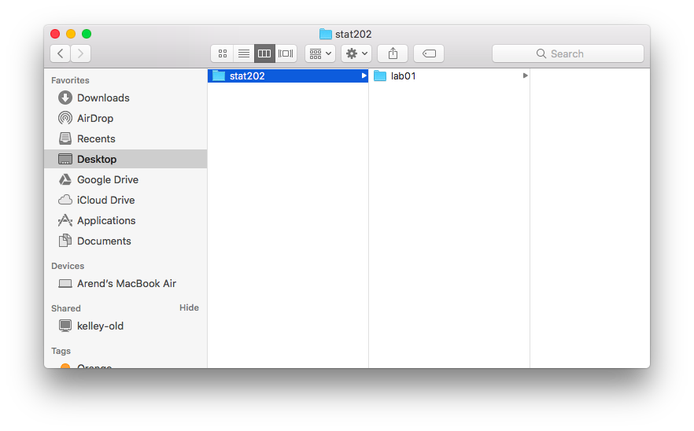
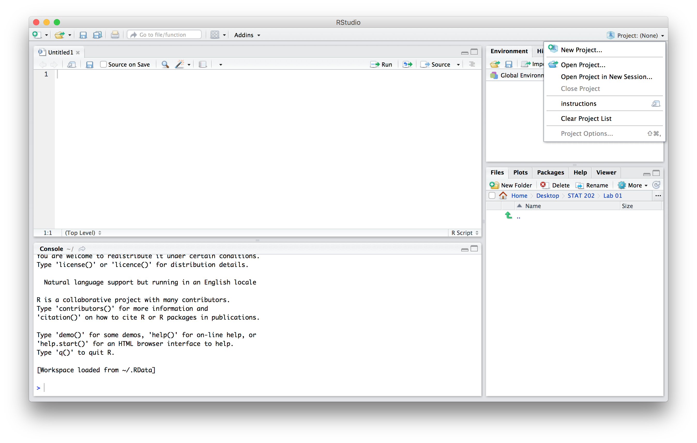
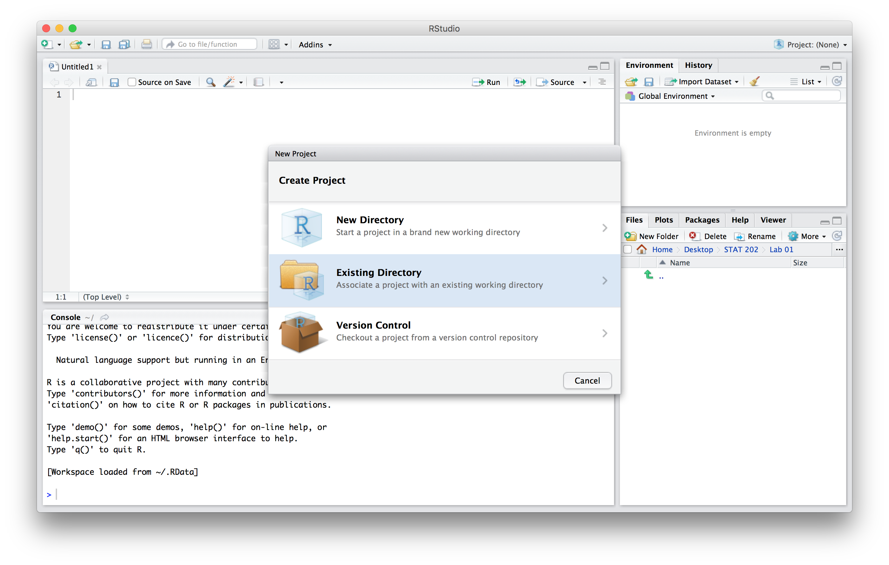
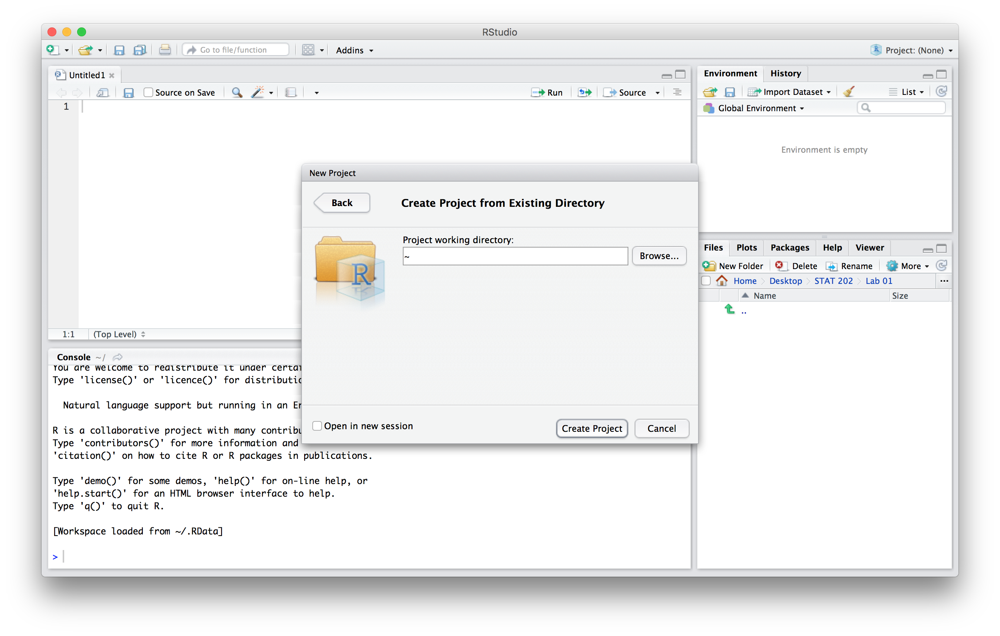
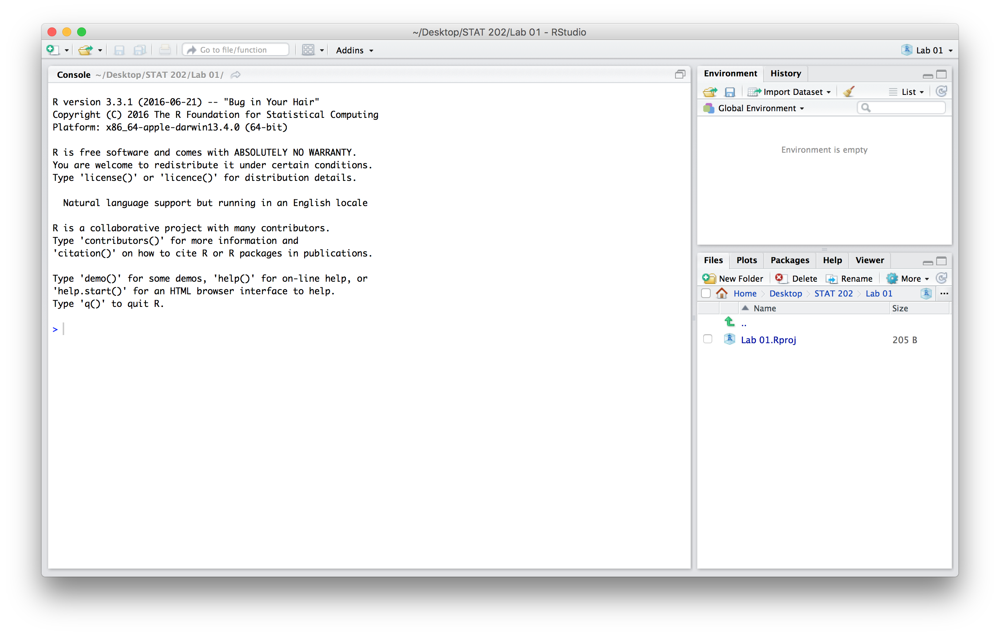
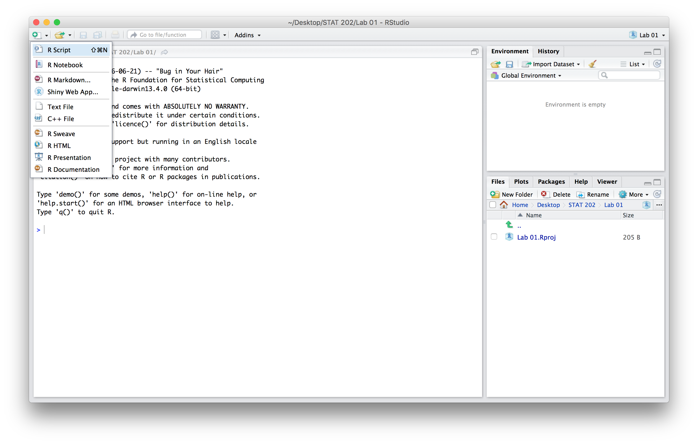
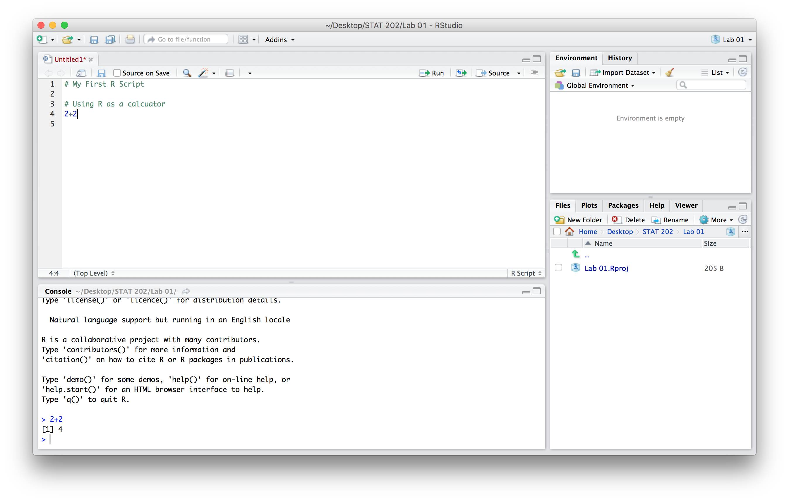
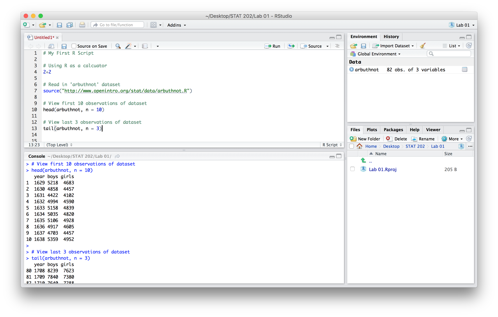

# Working Efficiently with RStudio

## Why RStudio?

RStudio is an extremely powerful tool that is intended to optimize how we interact with the statistical software known as [R](https://www.r-project.org/about.html). We could use R's basic interface, but [RStudio](https://www.rstudio.com/) is designed to streamline and organize statistical and analytic work with R. Like any tool we must learn how to use it properly, which is the focus of this lab.

While it might seem clunky or cumbersome at first, it is important to discipline yourself and adhere to sound workflow practices. Doing this from the very beginning will payoff immensely in later labs and beyond --- whether or not you intend to work with RStudio in the future. Exercising and expanding your mind to preform analytic coding will make you a better critical thinker and problem solver.

***

## Setting Up an R Project

It is important to recognize that quality analytic work requires that your work be easy to follow, replicate, and reference by others or by the future you. Therefore it is imperative that you strive to be as organized as possible. RStudio helps you organize all your work on a given data analysis/project through the creation of R projects.

There are several ways one could go about creating an R project, but we would suggest following the steps outlined below. These steps outline how to get setup for the first lab, but should, with obvious alterations, be followed for each lab.

**Step 1**

Create a folder somewhere on your computer, say on your desktop, and give it a descriptive name (e.g. STAT 202). This folder is where you will keep all of your work for each lab. You could save all your electronic notes here too.

**Step 2**

Next you will want to create a subfolder for an individual task or sub-project (e.g. **Lab 01**). The graphic below displays an example folder structure.  

**Step 3**

Open RStudio.

**Step 4**

4. Create a project by navigating to the upper right-hand corner of the program and clicking **Project (None) &raquo; New Project**.

**Step 5**

Select **Existing Directory**. Recall that in step 1, you created a file location for lab 1 --- our data analysis project.

**Step 6**

Click **Browse** and navigate to where you created the **Lab 01** folder. Select this folder and then click **Create Project**.

Your R project has now been created. Note that in the upper right-hand corner, the program indicates that you are working on the project named **Lab 01**.

**Step 7**

Creating an R script is the next MAJOR step in this process. Using a script file is key to organizing your code for quick reference. You should think of an R script file as a thorough record of how to conduct an analysis or solve the problem at hand. You should strive to make your R script as organized as possible so that someone else could work through your code and reproduce the same output/answers/results.

To create an R script, go to the upper left-hand corner and click the white box icon then select **R Script**.

**Step 8**

Now you can proceed to write your code in the R Script. You can also save your progress by clicking on the save icon located in the icon bar. Notice that it is saved within your R project folder --- **Lab 01** in this case. This is why we created an R project, so that all of our work for an analysis/project is kept in one central location.

Now, let's practice writing some R code. Good analytic code requires good comments. Comments are meant for human consumption and to explain what the executable code is doing. Therefore we need to let the program know that it is a comment and that it should not attempt to run it. In R, `#` is used to signal a comment. In RStudio, this will turn the line green, which indicates that it will be read as a comment --- see the figure below. Also notice how we use white space (empty lines) to make it easier on our eyes to navigate and read the script file. **Practice by typying the code that is pictured.**

We can use R as a calculator, as shown below. To run the line of code `2+2`, you place your cursor anywhere on the that line of code and click **Run**, which is located in the top right corner of the script pane. Alternatively, you could have used the keyboard short cut of **Command + return** (Mac) or **ctrl + enter** (PC).

You also have the option of running multiple lines of code by highlighting the lines of code and clicking **Run** or using the keyboard short cut.

After running the command, the result will show up in your Console pane, which is located beneath the Script pane. In the screenshot below, you can see that our `2+2` command has generated an answer of `4`.

Continue to practice writting an R script by reproducing the code depicted below. As the comments in the pictured code indicate, we are loading/reading-in the `arbuthnot` dataset. Then we are taking a look at some of the observations from the dataset by using the functions `head()` and `tail()`. Make sure to run the lines of code in order, otherwise the the software will return error messages. We suggest running one line at a time to ensure your code is typed correctly and to see what each line is doing.

Notice the copious usage of comments in our analytic code. In general, analytic code should make liberal use of comments. The length and specificity of comments depends on a person’s experience with a coding language. With experience comes the understanding and ability to write concise comments that cut directly to what information is absolutely necessary to communicate. It never hurts to have more comments than actual executable code, especially for those new to coding. Keep in mind that in the future you might want to share analytic code with co-workers or peers, or go back to reference code months or years after you’ve written it.  

***

## Summary

The essential workflow that should be followed for each lab:

1. Create and work in an R project to ensure all work is kept in a single location.
2. Organize your work within an R script.
    - Use comments to clearly communicate what the code is doing.
    - Use white space (empty lines and spaces) to make the document easier to read and navigate.

There are many other features of RStudio that you'll find useful, but are not covered in this document. RStudio strives to provide help in many different ways:

1. The help tab within the lower right-hand pane.
2. Help automatically appears when typing a function (auto-complete).
3. You may begin by typing the name of function and it will suggest several options.
